ArbreProba2b
============

* [page Github](https://github.com/TeddyBoomer/ArbreProba2b)

* [Téléchargement](https://github.com/TeddyBoomer/ArbreProba2b/releases)

* **commandes d'installation**: voir tout en bas de cette page.

Un objet python pour générer un arbre de probabilités: 
Il est généralement pénible de construire les graphes pour l'énoncé et la correction d'une situation d'arbre de probabilité.
 
dépendances:
============

* modules python: Graphviz, sympy — installés automatiquement
* logiciel [Graphviz](https://graphviz.org/) — à installer vous-même.


Illustration de principe:
=========================


```python
from ArbreProba2b import arbre_proba
from sympy import S

T = arbre_proba(a_cb=S(1)/4, b=S(3)/10, cab=S(1)/10, nbformat="fraction")
T.enonce_vide(intersection=True, mode = "full")
T.gv.render("enonce1-vide-frac")

T.enonce(intersection=True, mode="full")
T.gv.render("enonce1-full-frac")

T.enonce(intersection=True, mode='partial')
T.gv.render("enonce1-partial-frac")

T.solution(intersection=True, mode="full")
T.gv.render("solution1-full-frac")
```

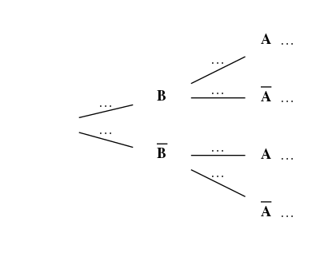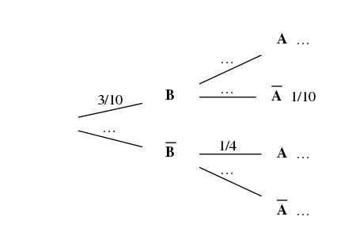
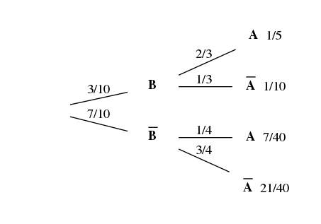

* L'option `mode` (`full` ou `partial`) permet d'afficher les probabilités des intersections en bout de branche.
* L'option `intersection` (booléen) indique si on doit afficher les probabilités d'intersection connues (même si `mode=partial`)
* L'objet `T` généré contient l'attribut `T.gv` (graphviz) qui génère l'image avec la méthode `T.gv.render()`.

Par défaut, l'image est en **.png**; on peut changer le format d'image avec son attribut:

```python
T.gv.format = "svg" # ou encore, "bmp", "jpg"…
```

On peut fournir un énoncé avec des événements indépendants, 
auquel cas il y a moins de données à fournir **(paramètre booléen `indep`)**

Représentation des probabilités en décimal (la gestion de la précision est automatique).

```python
U = arbre_proba(a=0.258, ab=0.05, indep=True, nbformat="decimal")
U.enonce_vide(intersection=True, mode="full")
U.gv.render("enonce2-vide-dec")

U.enonce(intersection=True, mode="full")
U.gv.render("enonce2-full-dec")

U.enonce(intersection=True, mode='partial')
U.gv.render("enonce2-partial-dec")

U.solution(intersection=True, mode="full")
U.gv.render("solution2-full-dec")
```

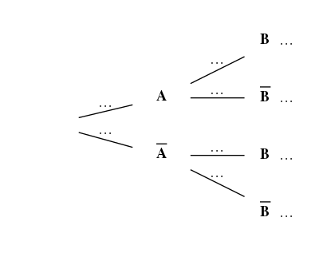
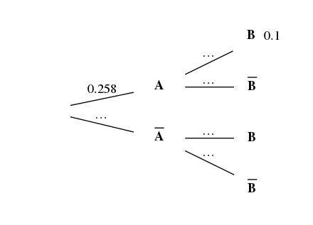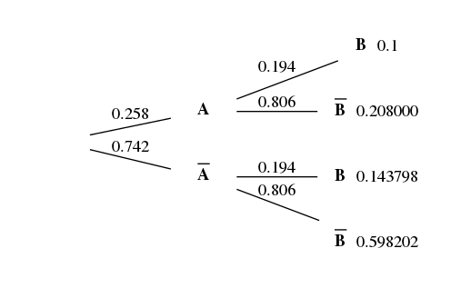

Réglage des noms des événements, et passage en % 

```python
V = arbre_proba(a=0.25, ab=0.05, indep=True, nbformat="pourcentage", 
                  noms=["café", "tarte"])
V.enonce_vide(intersection=True, mode="full")
V.gv.render("enonce3-vide-pourc")

V.enonce(intersection=True, mode="full")
V.gv.render("enonce3-full-pourc")

V.enonce(intersection=True, mode='partial')
V.gv.render("enonce3-partial-pourc")

V.solution(intersection=True, mode="full")
V.gv.render("solution3-full-pourc")
```

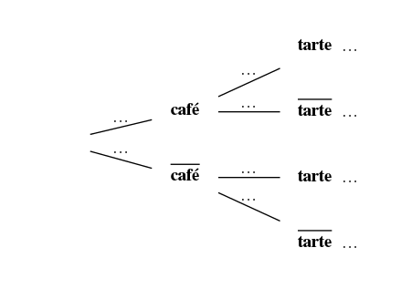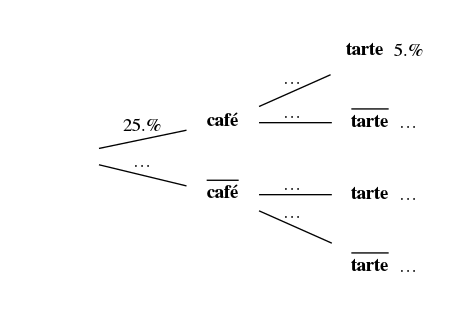
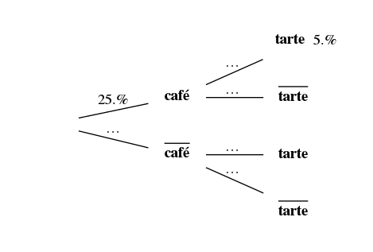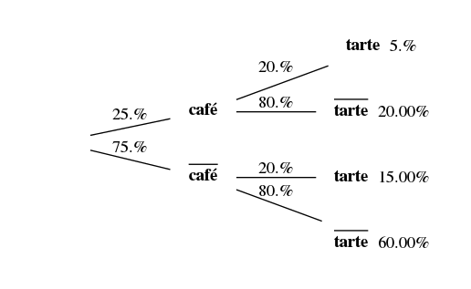

Les noms sont du simple texte et vous ne pourrez pas mettre des indices ou des notations type LaTeX.

Si vous ne donnez que la probabilité `b` ou `cb=1-b` dans les paramètres, 
alors, l'arbre généré commencera automatiquement par l'événement B.

```python
W = arbre_proba(b=0.42, ab=0.06, indep=True, nbformat="pourcentage", noms=["café", "tarte"])
W.solution(mode="partial")
W.gv.render("solution4-partial-pourc")
```
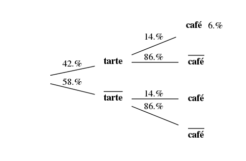

Notation des probabilités:
==========================

Les probabilités sont notées de façon générique pour deux événements. 
* *a, ca, b, cb*: la probabilité de A, du complémentaire de A, de B, du complémentaire de B
* *a_b*: probabilité conditionnelle de A sachant B
* *ca_cb*: probabilité conditionnelle du complémentaire de A sachant celui de B
* *b_ca*: celle de B sachant le complémentaire de A
* etc.
* *ab*: probabilité de l'intersection de A et B
* *cab*: celle du complémentaire de A et de B
* *cacb, acb*: intersections de la même façon…

Attention, du coup, pour les intersections, le nom commence par *a* ou *ca*, donc il faut bien noter *cab* et non *bca*.

Représentation des nombres
==========================

Les probabilités peuvent être renseignées en nombre décimal, 
mais si vous voulez plus de rigueur, des fractions sont préférables.

Pour renseigner une fraction, il faut la *sympyfier* (objet sympy `Rational`), pour 3/10 par exemple:
```python
S(3)/10
3/S(10)
Rational(3, 10)
```
sont trois écritures valides de la même fraction.

Dans l'objet `arbre_proba`, l'option `nbformat` permet de préciser le format de représentation des nombres. 

Il peut prendre l'une des valeurs `decimal`, `pourcentage`, `fraction`. 

La précision est calculée automatiquement: si vos probabilités comportent au plus 3 chiffres après la virgule,
alors les représentations décimales auront 3 chiffres sur les branches, et 6 sur les poids des intersections.


Installation ou mise à jour
===========================

Module en Python3. Il vous est conseillé d'utiliser une
version de Python >=3.4. En effet, à partir de là, l'installateur pip
standardise l'installation des modules (et utilise le plus récent format
d'archive **wheel**)

L'installateur pip veillera à installer les dépendances.

Pour windows:

```
py -3 -m pip install \chemin\vers\ArbreProba2b-xxx-py3-none-any.whl
```

Pour linux:

```
pip3 install  /chemin/vers/ArbreProba2b-xxx-py3-none-any.whl
```

Pour mettre à jour quand on a déjà le module, on peut ajouter un paramètre `-U`
ou `--upgrade` pour accepter la version la plus récente.
